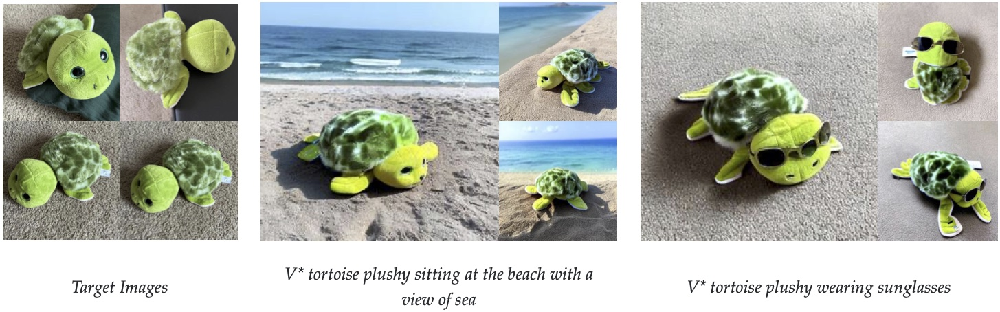
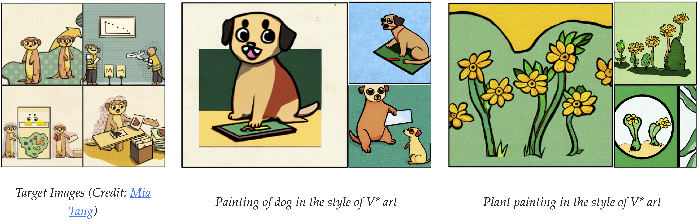
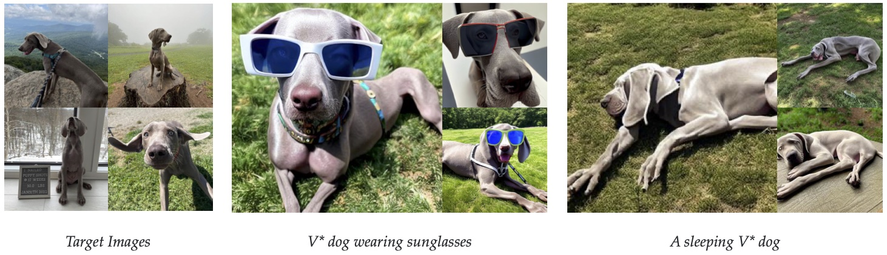

# Subject Centric Image Generation

Project goal: to generate subject in images based on a few photos of them. Subjects in this case refer to people.

The codebase is a merge of [Multi-Concept Customization of Text-to-Image Diffusion (Custom Diffusion)](https://github.com/adobe-research/custom-diffusion) and [Cross Initialisation for Face Personalisation of Text-to-Image Models (Cross initialisation)](https://github.com/lyuPang/CrossInitialization). Their original READMEs are shown below.

## Experiment

For all setups, the base model is stable-diffusion v1.5

We run the code with different setups:

- **Custom diffusion (CD) with no regularisation data**: trained with no regularisation data. Run it with `pipeline_no_reg.sh`
- **Custom diffusion (CD) with generated regularisation data**: trained with generated data as regularisation. The data is generated using the base model. Run it with `pipeline_reg.sh`. Will run longer because data need to be generated first.
- **Custom diffusion (CD) with alternative generated regularisation data**: trained with another set of generated data as regularisation. The model is generated using a 'higher fidelity' model: juggernautXI (a finetuned SDXL model) with bad_quality lora. Run it with `pipeline_alt_reg.sh`
- **Cross Intialization (CR) with textual embedding**: trained with Cross initialisation method -  a form of textual inversion method except the modifier tokens are trained with the average embeddings of celebrities' faces. Run it with `pipeline_cr.sh`
- **CD + CR with generated regularisation data**: combination of Custom Diffusion and Cross initialisation. CD finetune the cross attention and CR finetune the text embeddings. Run it with `pipeline_reg_cr.sh`. Will run longer because data need to be generated first.
- You will need to update the corresponding directory and `batch_eval_output_*.json`

Common parameters:

- CR and CD parameters are trained as recommended in their git README.
  - CD is trained with the recommended setting of 2 GPU. One can run with 1 GPU but the learning rate needs to be tuned. 
- For faces, CD's authors suggest the following parameters;
  - max_train_steps: 1500
  - learning_rate: 5e-6
  - freeze_model: crossattn

## Installation

The experiment runs on Python 3.10. Packages are stated in `requirements.txt`. diffusers requirement are quite fixed, upgrading it will be a problem. Note, while deepspeed is installed, it does not work on this. Accelerate config is run using bf16, no deepspeed.


# Original READMEs

## Custom Diffusion

#### [website](https://www.cs.cmu.edu/~custom-diffusion/)  | [paper](http://arxiv.org/abs/2212.04488) 


**[NEW!]** Custom Diffusion is now supported in diffusers. Please [refer](https://github.com/huggingface/diffusers/tree/main/examples/custom_diffusion) here for training and inference details. 

**[NEW!]** CustomConcept101 dataset. We release a new dataset of 101 concepts along with their evaluation prompts. For more details please refer [here](customconcept101/README.md).  

**[NEW!]** Custom Diffusion with SDXL. Diffusers code now with updated diffusers==0.21.4. 

<br>
<div class="gif">
<p align="center">

</p>
</div>

[Custom Diffusion](https://www.cs.cmu.edu/~custom-diffusion) allows you to fine-tune text-to-image diffusion models, such as [Stable Diffusion](https://github.com/CompVis/stable-diffusion), given a few images of a new concept (~4-20). Our method is fast (~6 minutes on 2 A100 GPUs) as it fine-tunes only a subset of model parameters, namely key and value projection matrices, in the cross-attention layers. This also reduces the extra storage for each additional concept to 75MB.

Our method further allows you to use a combination of multiple concepts such as new object + new artistic style, multiple new objects, and new object + new category. See [multi-concept results](#multi-concept-results) for more visual results. 

***Multi-Concept Customization of Text-to-Image Diffusion*** <br>
[Nupur Kumari](https://nupurkmr9.github.io/), [Bingliang Zhang](https://zhangbingliang2019.github.io), [Richard Zhang](https://richzhang.github.io/), [Eli Shechtman](https://research.adobe.com/person/eli-shechtman/), [Jun-Yan Zhu](https://www.cs.cmu.edu/~junyanz/)<br>
In CVPR 2023 <br>


### Results

All our results are based on fine-tuning [stable-diffusion-v1-4](https://huggingface.co/CompVis/stable-diffusion-v-1-4-original) model.
We show results on various categories of images, including scene, pet, personal toy, and style, and with a varying number of training samples. 
For more generations and comparisons with concurrent methods, please refer to our [webpage](https://www.cs.cmu.edu/~custom-diffusion/) and [gallery](https://www.cs.cmu.edu/~custom-diffusion/results.html).


#### Single-Concept Results

<div>
<p align="center">

</p>
<p align="center">

</p>
<p align="center">

</p>
<p align="center">

</p>
<p align="center">

</p>
<p align="center">

</p>
<p align="center">

</p>
<p align="center">

</p>
</div>


#### Multi-Concept Results


<div>
<p align="center">

</p>
<p align="center">

</p>
<p align="center">

</p>
<p align="center">

</p>
</div>


### Method Details


<div>
<p align="center">

</p>
</div>


Given the few user-provided images of a concept, our method augments a pre-trained text-to-image diffusion model, enabling new generations of the concept in unseen contexts. 
We fine-tune a small subset of model weights, namely the key and value mapping from text to latent features in the cross-attention layers of the diffusion model. 
Our method also uses a small set of regularization images (200) to prevent overfitting. For personal categories, we add a new modifier token V* in front of the category name, e.g., V* dog. For multiple concepts, we jointly train on the dataset for the two concepts. Our method also enables the merging of two fine-tuned models using optimization. For more details, please refer to our [paper](https://arxiv.org/abs/2212.04488).  

### Getting Started

```
git clone https://github.com/adobe-research/custom-diffusion.git
cd custom-diffusion
git clone https://github.com/CompVis/stable-diffusion.git
cd stable-diffusion
conda env create -f environment.yaml
conda activate ldm
pip install clip-retrieval tqdm
```

Our code was developed on the following commit `#21f890f9da3cfbeaba8e2ac3c425ee9e998d5229` of [stable-diffusion](https://github.com/CompVis/stable-diffusion).

Download the stable-diffusion model checkpoint
`wget https://huggingface.co/CompVis/stable-diffusion-v-1-4-original/resolve/main/sd-v1-4.ckpt`
For more details, please refer [here](https://huggingface.co/CompVis/stable-diffusion-v-1-4-original).

**Dataset:** we release some of the datasets used in paper [here](https://www.cs.cmu.edu/~custom-diffusion/assets/data.zip). 
Images taken from UnSplash are under [UnSplash LICENSE](https://unsplash.com/license). Moongate dataset can be downloaded from [here](https://github.com/odegeasslbc/FastGAN-pytorch).

**Models:** all our models can be downloaded from [here](https://www.cs.cmu.edu/~custom-diffusion/assets/models/). 

#### Single-Concept Fine-tuning

**Real images as regularization**
```
## download dataset
wget https://www.cs.cmu.edu/~custom-diffusion/assets/data.zip
unzip data.zip

## run training (30 GB on 2 GPUs)
bash scripts/finetune_real.sh "cat" data/cat real_reg/samples_cat  cat finetune_addtoken.yaml <pretrained-model-path>

## save updated model weights
python src/get_deltas.py --path logs/<folder-name> --newtoken 1

## sample
python sample.py --prompt "<new1> cat playing with a ball" --delta_ckpt logs/<folder-name>/checkpoints/delta_epoch\=000004.ckpt --ckpt <pretrained-model-path>
```

The `<pretrained-model-path>` is the path to the pretrained `sd-v1-4.ckpt` model. Our results in the paper are not based on the [clip-retrieval](https://github.com/rom1504/clip-retrieval) for retrieving real images as the regularization samples. But this also leads to similar results.

**Generated images as regularization**
```
bash scripts/finetune_gen.sh "cat" data/cat gen_reg/samples_cat  cat finetune_addtoken.yaml <pretrained-model-path>
```


#### Multi-Concept Fine-tuning

**Joint training**

```
## run training (30 GB on 2 GPUs)
bash scripts/finetune_joint.sh "wooden pot" data/wooden_pot real_reg/samples_wooden_pot \
                                    "cat" data/cat real_reg/samples_cat  \
                                    wooden_pot+cat finetune_joint.yaml <pretrained-model-path>

## save updated model weights
python src/get_deltas.py --path logs/<folder-name> --newtoken 2

## sample
python sample.py --prompt "the <new2> cat sculpture in the style of a <new1> wooden pot" --delta_ckpt logs/<folder-name>/checkpoints/delta_epoch\=000004.ckpt --ckpt <pretrained-model-path>
```

**Optimization based weights merging**

Given two fine-tuned model weights `delta_ckpt1` and `delta_ckpt2` for any two categories, the weights can be merged to create a single model as shown below.  
```
python src/composenW.py --paths <delta_ckpt1>+<delta_ckpt2> --categories  "wooden pot+cat"  --ckpt <pretrained-model-path> 

## sample
python sample.py --prompt "the <new2> cat sculpture in the style of a <new1> wooden pot" --delta_ckpt optimized_logs/<folder-name>/checkpoints/delta_epoch\=000000.ckpt --ckpt <pretrained-model-path>
```


#### Training using Diffusers library

**[NEW!]** Custom Diffusion is also supported in diffusers now. Please [refer](https://github.com/huggingface/diffusers/tree/main/examples/custom_diffusion) here for training and inference details. 


```
## install requirements 
pip install accelerate>=0.24.1
pip install modelcards
pip install transformers>=4.31.0
pip install deepspeed
pip install diffusers==0.21.4
accelerate config
export MODEL_NAME="CompVis/stable-diffusion-v1-4"
```

**Single-Concept fine-tuning**

```
## launch training script (2 GPUs recommended, increase --max_train_steps to 500 if 1 GPU)

accelerate launch src/diffusers_training.py \
          --pretrained_model_name_or_path=$MODEL_NAME  \
          --instance_data_dir=./data/cat  \
          --class_data_dir=./real_reg/samples_cat/ \
          --output_dir=./logs/cat  \
          --with_prior_preservation --real_prior --prior_loss_weight=1.0 \
          --instance_prompt="photo of a <new1> cat"  \
          --class_prompt="cat" \
          --resolution=512  \
          --train_batch_size=2  \
          --learning_rate=1e-5  \
          --lr_warmup_steps=0 \
          --max_train_steps=250 \
          --num_class_images=200 \
          --scale_lr --hflip  \
          --modifier_token "<new1>"

## sample 
python src/diffusers_sample.py --delta_ckpt logs/cat/delta.bin --ckpt "CompVis/stable-diffusion-v1-4" --prompt "<new1> cat playing with a ball"
```

You can also use `--enable_xformers_memory_efficient_attention` and enable `fp16` during `accelerate config` for faster training with lower VRAM requirement. To train with SDXL use `diffusers_training_sdxl.py` with `MODEL_NAME="stabilityai/stable-diffusion-xl-base-1.0"`.

**Multi-Concept fine-tuning**

Provide a [json](assets/concept_list.json) file with the info about each concept, similar to [this](https://github.com/ShivamShrirao/diffusers/blob/main/examples/dreambooth/train_dreambooth.py).
```
## launch training script (2 GPUs recommended, increase --max_train_steps to 1000 if 1 GPU)

accelerate launch src/diffusers_training.py \
          --pretrained_model_name_or_path=$MODEL_NAME  \
          --output_dir=./logs/cat_wooden_pot  \
          --concepts_list=./assets/concept_list.json \
          --with_prior_preservation --real_prior --prior_loss_weight=1.0 \
          --resolution=512  \
          --train_batch_size=2  \
          --learning_rate=1e-5  \
          --lr_warmup_steps=0 \
          --max_train_steps=500 \
          --num_class_images=200 \
          --scale_lr --hflip  \
          --modifier_token "<new1>+<new2>" 

## sample 
python src/diffusers_sample.py --delta_ckpt logs/cat_wooden_pot/delta.bin --ckpt "CompVis/stable-diffusion-v1-4" --prompt "<new1> cat sitting inside a <new2> wooden pot and looking up"
```

**Optimization based weights merging for Multi-Concept**

Given two fine-tuned model weights `delta1.bin` and `delta2.bin` for any two categories, the weights can be merged to create a single model as shown below.  
```
python src/diffusers_composenW.py --paths <delta1.bin>+<delta2.bin> --categories  "wooden pot+cat"  --ckpt "CompVis/stable-diffusion-v1-4"

## sample
python src/diffusers_sample.py --delta_ckpt optimized_logs/<folder-name>/delta.bin --ckpt "CompVis/stable-diffusion-v1-4" --prompt "<new1> cat sitting inside a <new2> wooden pot and looking up"
```

The diffuser training code is modified from the following [DreamBooth]( https://github.com/huggingface/diffusers/blob/main/examples/dreambooth/train_dreambooth.py), [Textual Inversion](https://github.com/huggingface/diffusers/blob/main/examples/textual_inversion/textual_inversion.py) training scripts. For more details on how to setup accelarate please refer [here](https://github.com/huggingface/diffusers/blob/main/examples/dreambooth).

#### Fine-tuning on human faces

For fine-tuning on human faces, we recommend `learning_rate=5e-6` and `max_train_steps=750` in the above diffuser training script or using `finetune_face.yaml` config in stable-diffusion training script. 

We observe better results with a lower learning rate, longer training, and more images for human faces compared to other categories shown in our paper. With fewer images, fine-tuning all parameters in the cross-attention is slightly better, which can be enabled with `--freeze_model "crossattn"`.  
Example results on fine-tuning with 14 close-up photos of [Richard Zhang](https://richzhang.github.io/) with the diffusers training script. 

<div>
<p align="center">

</p>
</div>

#### Model compression

```
python src/compress.py --delta_ckpt <finetuned-delta-path> --ckpt <pretrained-model-path>

## sample
python sample.py --prompt "<new1> cat playing with a ball" --delta_ckpt logs/<folder-name>/checkpoints/compressed_delta_epoch\=000004.ckpt --ckpt <pretrained-model-path> --compress
```

Sample generations with different level of compression. By default our code saves the low-rank approximation with top 60% singular values to result in ~15 MB models. 
<div>
<p align="center">

</p>
</div>

#### Checkpoint conversions for stable-diffusion-v1-4

* From diffusers `delta.bin` to CompVis `delta_model.ckpt`. 
```
python src/convert.py --delta_ckpt <path-to-folder>/delta.bin --ckpt <path-to-model-v1-4.ckpt> --mode diffuser-to-compvis                  
# sample
python sample.py --delta_ckpt <path-to-folder>/delta_model.ckpt --ckpt <path-to-model-v1-4.ckpt> --prompt <text-prompt> --config configs/custom-diffusion/finetune_addtoken.yaml
```

* From diffusers `delta.bin` to [stable-diffusion-webui](https://github.com/AUTOMATIC1111/stable-diffusion-webui) checkpoint. 
```
python src/convert.py --delta_ckpt <path-to-folder>/delta.bin --ckpt <path-to-model-v1-4.ckpt> --mode diffuser-to-webui                  
# launch UI in stable-diffusion-webui directory
bash webui.sh --embeddings-dir <path-to-folder>/webui/embeddings  --ckpt <path-to-folder>/webui/model.ckpt
```

* From CompVis `delta_model.ckpt` to diffusers `delta.bin`. 
```
python src/convert.py --delta_ckpt <path-to-folder>/delta_model.ckpt --ckpt <path-to-model-v1-4.ckpt> --mode compvis-to-diffuser                  
# sample
python src/diffusers_sample.py --delta_ckpt <path-to-folder>/delta.bin --ckpt "CompVis/stable-diffusion-v1-4" --prompt <text-prompt>
```

* From CompVis `delta_model.ckpt` [stable-diffusion-webui](https://github.com/AUTOMATIC1111/stable-diffusion-webui) checkpoint. 
```
python src/convert.py --delta_ckpt <path-to-folder>/delta_model.ckpt --ckpt <path-to-model-v1-4.ckpt> --mode compvis-to-webui                  
# launch UI in stable-diffusion-webui directory
bash webui.sh --embeddings-dir <path-to-folder>/webui/embeddings  --ckpt <path-to-folder>/webui/model.ckpt
```
Converted checkpoints are saved in the `<path-to-folder>` of the original checkpoints. 


### References

```
@article{kumari2022customdiffusion,
  title={Multi-Concept Customization of Text-to-Image Diffusion},
  author={Kumari, Nupur and Zhang, Bingliang and Zhang, Richard and Shechtman, Eli and Zhu, Jun-Yan},
  booktitle = {Proceedings of the IEEE/CVF Conference on Computer Vision and Pattern Recognition (CVPR)},
  year      = {2023}
}
```

### Acknowledgments
We are grateful to Nick Kolkin, David Bau, Sheng-Yu Wang, Gaurav Parmar, John Nack, and Sylvain Paris for their helpful comments and discussion, and to Allie Chang, Chen Wu, Sumith Kulal, Minguk Kang, Yotam Nitzan, and Taesung Park for proofreading the draft. We also thank Mia Tang and Aaron Hertzmann for sharing their artwork. Some of the datasets are downloaded from Unsplash. This work was partly done by Nupur Kumari during the Adobe internship. The work is partly supported by Adobe Inc. 

## Cross Initialization (CVPR 2024)

Official Implementation of **"Cross Initialization for Face Personalization of Text-to-Image Models"** by Lianyu Pang, Jian Yin, Haoran Xie, Qiping Wang, Qing Li, Xudong Mao

### Abstract
> Recently, there has been a surge in face personalization techniques, benefiting from the advanced capabilities of pretrained text-to-image diffusion models. Among these, a notable method is Textual Inversion, which generates personalized images by inverting given images into textual embeddings. However, methods based on Textual Inversion still struggle with balancing the trade-off between reconstruction quality and editability. In this study, we examine this issue through the lens of initialization. Upon closely examining traditional initialization methods, we identified a significant disparity between the initial and learned embeddings in terms of both scale and orientation. The scale of the learned embedding can be up to 100 times greater than that of the initial embedding. Such a significant change in the embedding could increase the risk of overfitting, thereby compromising the editability. Driven by this observation, we introduce a novel initialization method, termed Cross Initialization, that significantly narrows the gap between the initial and learned embeddings. This method not only improves both reconstruction and editability but also reduces the optimization steps from 5,000 to 320. Furthermore, we apply a regularization term to keep the learned embedding close to the initial embedding. We show that when combined with Cross Initialization, this regularization term can effectively improve editability. We provide comprehensive empirical evidence to demonstrate the superior performance of our method compared to the baseline methods. Notably, in our experiments, Cross Initialization is the only method that successfully edits an individual's facial expression. Additionally, a fast version of our method allows for capturing an input image in roughly 26 seconds, while surpassing the baseline methods in terms of both reconstruction and editability.


<a href="https://arxiv.org/abs/2312.15905"></a>

## Update
+ **2024.3.2**: Code released!

### Setup
Our code mainly bases on [Diffusers-Textual Inversion](https://github.com/huggingface/diffusers/tree/main/examples/textual_inversion) and relies on the [diffusers](https://github.com/huggingface/diffusers) library.

To set up the environment, please run:
```
conda create -n ci python=3.10
conda activate ci

pip install -r requirements.txt
```

### Dataset
#### Image Dataset
We use CelebA dataset to test our method, which can be downloaded from [here](https://mmlab.ie.cuhk.edu.hk/projects/CelebA.html).

We also provide some images for testing in `./examples/input_images`, which are also from CelebA.

#### Celeb Name Dataset
The Celeb names in `./examples/wiki_names_v2.txt` used in this project are from [Celeb Basis](https://github.com/ygtxr1997/CelebBasis/tree/main). We are very grateful for their contributions.

### Usage


#### Logging into Huggingface
To use `stabilityai/stable-diffusion-2-1-base` model, you may have to log into Huggingface as following

+ Use `huggingface-cli` to login in Terminal
+ Input your token extracted from [Token](https://huggingface.co/settings/tokens)

#### Training
You can simply run the `train_cross_init.py` script and pass the parameters to train your own result.

For example, to train the identity in `./examples/input_images/28017`, you can run:
```
python train_cross_init.py \
    --save_steps 100 \
    --only_save_embeds \
    --placeholder_token "<28017>" \
    --train_batch_size 8 \
    --scale_lr \
    --n_persudo_tokens 2 \
    --reg_weight "1e-5" \
    --learning_rate 0.000625 \
    --max_train_step 320 \
    --train_data_dir "./examples/input_images/28017" \
    --celeb_path "./examples/wiki_names_v2.txt" \
    --pretrained_model_name_or_path "stabilityai/stable-diffusion-2-1-base" \
    --output_dir "./logs/28017/learned_embeddings" 
```
Please refer to `train_cross_init.py` for more details on all parameters.

#### Inference
To run inference on a learned embedding, you can run:
```
python test_cross_init.py \
    --pretrained_model_name_or_path "stabilityai/stable-diffusion-2-1-base" \
    --num_inference_steps 50 \
    --learned_embedding_path "./logs/28017/learned_embeddings/learned_embeds.bin" \
    --prompt "a photo of a {} person" \
    --save_dir "./logs/28017/images" \
    --num_images_per_prompt=8 \
    --n_iter=1
```
**Note:**

+ We provide learned embeddings in `./examples/learned_embeddings` for anyone who wants to directly experiment with our methods.
+ For convenience, you can either specify a path to a text file with  `--prompt_file`, where each line contains a prompt. For example:
    ```
    A photo of a {} person
    A {} person eating bread in front of the Eiffel Tower
    A {} person latte art
    ```
+ The identity placement should be specified using `{}`, and we will replace `{}` with the identity's placeholder token that is saved in the learned embedding checkpoint.
+ The generated images will be saved to the path `{save_dir}/{prompt}`

Please refer to `test_cross_init.py` for more details on all parameters.

### Metrics
We use the same evaluation protocol as used in [Celeb Basis](https://github.com/ygtxr1997/CelebBasis/tree/main).

### Results of Our Fast Version
The following results are obtained after 25 optimization steps, each image taking 26 seconds on an A800 GPU.


### Acknowledgements
Our code mainly bases on [Diffusers-Textual Inversion](https://github.com/huggingface/diffusers/tree/main/examples/textual_inversion), and the celeb names used in this project are from [Celeb Basis](https://github.com/ygtxr1997/CelebBasis/tree/main). A huge thank you to the authors for their valuable contributions.

### References

```
@article{pang2023crossinitialization,
  title = {Cross Initialization for Face Personalization of Text-to-Image Models},
  author = {Pang, Lianyu and Yin, Jian and Xie, Haoran and Wang, Qiping and Li, Qing and Mao, Xudong},
  journal = {arXiv preprint arXiv:2312.15905},
  year = {2023}
}