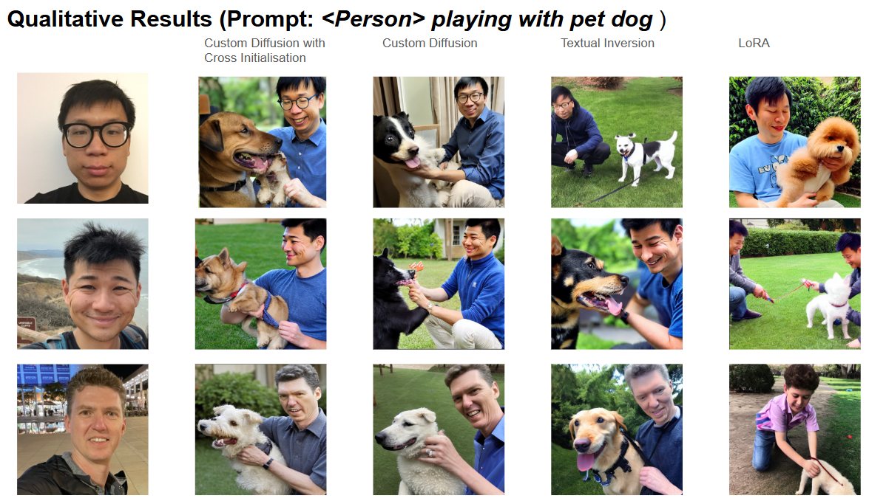

# Generating faces with diffusion-based models

## Introduction

In this project, we explore various method for personalized content synthesis applied to face generation using few user-specified samples. Namely, Custom Diffusion, Cross Initialization, LoRA and Textual Inversion. We also propose to combine the Custom Diffusion method with the Cross Initialization method and provide some evaluation metrics we used to assert the quality of the different methods used. 

## Code structure

The codebase is divided as follow :

1. `custom-diffusion` folder contains the code of the original custom diffusion and cross initialization methods, and of our method. It also contains several bash file we used to make our experiments.

2. `evaluation` folder contains methods for the CLIP and InsightFace's SCRFD metrics evaluation.

3. `lora` folder contains bash files to finetune a model using the LoRA method with a user-specified concept, and to generate samples using lora weights.

4. `textual_inversion` folder contains bash files to finetune a model using Textual Inversion method with a user-specified concept, and to generate samples.

Further information can be found in each folder `readme.md` file.

